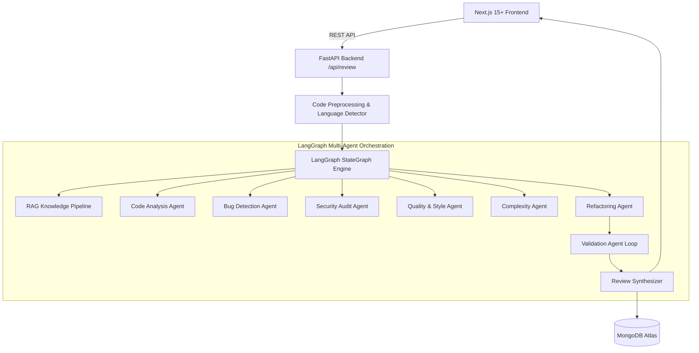

# AI Code Reviewer & Refactoring Platform (v1.0.0)

> **Multi-Agent Orchestrated Static Code Analysis, Vulnerability Auditing & Automatic Refactoring**

Built with **Next.js (TypeScript)**, **FastAPI (Python)**, **LangChain**, **LangGraph**, **Google Gemini** (primary) + **Mistral AI** (fallback), **MongoDB Atlas** (persistence & vector search), and **LangSmith** (observability).

---

## 🌟 Key Features

- **⚡ Dual Review Modes**:
  - **Quick Scan**: Sub-second syntax and high-priority logic check without external overhead.
  - **Deep Review**: Full 8-agent orchestrated workflow enriched with RAG vulnerability knowledge.
- **🤖 8 Specialized Agents**: Code Analysis, Bug Hunter, Security Auditor, Quality/Style Linter, Complexity Assessor, Refactoring Generator, Syntax/Intent Validator, and Review Synthesizer.
- **🛡️ Multi-Provider AI Failover**: Seamless automatic failover from Google Gemini to Mistral AI on rate limits or outages.
- **🔄 Refactoring Validation Loop**: AST parser and structural interface checks verify that refactored code has zero syntax errors before showing it to the user.
- **⚖️ Side-by-Side Diff Comparison**: Synchronized scrolling view highlighting modified, added, and removed lines.
- **📥 Client-Side Markdown Export**: 1-click download of the complete review report with safe code-block escaping.
- **🔒 Enterprise Security Hardening**: Static analysis only — user code is strictly analyzed as data and is **never executed**. In-memory rate limiting, prompt injection delimiters, and secret redaction.

---

## 🏗️ Architecture Overview



---

## 🚀 Quick Start Instructions

### Prerequisites
- Node.js 18+ and npm
- Python 3.10+
- (Optional) MongoDB Atlas URI & Gemini / Mistral API Keys

### 1. Clone and Setup Environment
```bash
git clone https://github.com/SivaranjaniSenthil2005/Code-Reviewer.git
cd Code-Reviewer

# Configure backend environment variables
cp .env.example backend/.env
```

### 2. Run Backend (FastAPI)
```bash
cd backend
python -m venv .venv
# On Windows:
.venv\Scripts\activate
# On Linux/macOS:
# source .venv/bin/activate

pip install -r requirements.txt
uvicorn app.main:app --reload --port 8000
```
Backend will be live at `http://localhost:8000` (Swagger docs at `http://localhost:8000/docs`).

### 3. Run Frontend (Next.js)
```bash
cd ../frontend
npm install
npm run dev
```
Frontend will be live at `http://localhost:3000`.

---

## 🧪 Running Automated Tests

```bash
# Run backend pytest suite (65+ tests across all 22 phases)
cd backend
pytest ../tests/ -v

# Run frontend Next.js production build check
cd ../frontend
npm run build
```

---

## 📚 Documentation Directory

- 📐 [Architecture Reference](docs/ARCHITECTURE.md)
- 🤖 [Multi-Agent Design](docs/AGENTS.md)
- 🧠 [RAG Knowledge Base](docs/RAG.md)
- 🔌 [API Specification](docs/API.md)
- 📊 [AI Evaluation & Benchmarks](docs/EVALUATION.md)
- 🚢 [Production Deployment](docs/DEPLOYMENT.md)

---

## 📄 License
MIT License.
