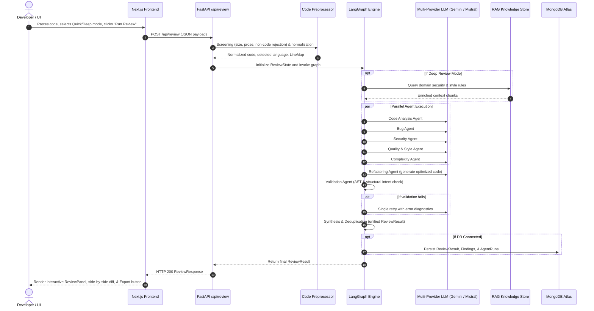

# Architecture Reference & Data Flow

This document details the final architecture, component interfaces, state management, and data lifecycle of the AI Code Review & Refactoring Platform.

---

## 1. System Topology & Data Flow

---

## 2. Core Subsystems

### 1. Code Preprocessing Layer (`app/services/code/`)
- `language_detector.py`: 4-tier detection (explicit hint → SHA256 cache → extension → shebang → keyword heuristics).
- `validator.py`: Input screening (prose vs code, size limits) + language AST parser.
- `normalizer.py`: CRLF to LF, trailing whitespace removal, Python 4-space tab expansion, excessive blank line collapse.
- `line_mapper.py`: Bidirectional index mapping original coordinates to normalized lines so finding references stay 100% accurate.

### 2. Multi-Provider LLM Layer (`app/services/llm/`)
- `GeminiProvider`: Primary high-throughput provider using Gemini 1.5.
- `MistralProvider`: Automatic fallback provider on rate limits, timeouts, or quota errors.
- `LLMRouter`: Unifies primary-to-fallback routing with structured schema output parsing.

### 3. Orchestration Engine (`app/graph/`)
- Built on LangGraph `StateGraph` with explicit `ReviewState` transitions.
- Dynamically compiles `quick_review.py` or `deep_review.py` based on user depth preference.

### 4. Persistence Layer (`app/repositories/`)
- `ReviewRepository`: Stores high-level review metadata and executive summaries.
- `FindingRepository`: Stores granular defect items indexed by line, severity, and category.
- `AgentRunRepository`: Logs audit execution metrics per agent.
