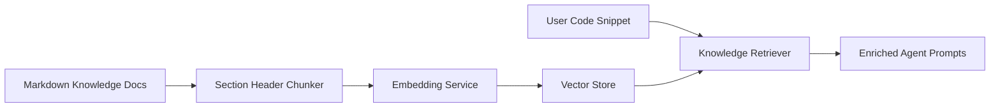

# RAG Knowledge Retrieval Pipeline

This document details the Retrieval-Augmented Generation (RAG) subsystem used to ground security, bug, and quality agents in validated industry standards and language best practices.

---

## 1. Knowledge Base Sources

The starter knowledge base contains curated documentation across:
- **OWASP Top 10 Security Flaws**: SQL Injection (CWE-89), Hardcoded Credentials (CWE-798), Cross-Site Scripting (CWE-79), Insecure Deserialization (CWE-502).
- **Language Anti-Patterns**: Python mutable default arguments, resource descriptor leaks, JavaScript unhandled async promise rejections, Go nil channel deadlocks.
- **Clean Code Standards**: PEP 8 styling conventions, naming conventions, and modularity principles.

---

## 2. Ingestion & Retrieval Pipeline

### Retrieval Mechanics
- **Chunking**: Header-based chunking (`#`, `##`) preserving section titles and document categories.
- **Embeddings**: Deterministic dense vector embeddings with unit norm normalization (128 dimensions).
- **Similarity Metric**: Cosine similarity matching with language and category metadata filtering.
- **Graceful Fallback**: If the vector store is uninitialized or the embedding service encounters an error, the pipeline silently returns empty context allowing agents to proceed without interruption.
