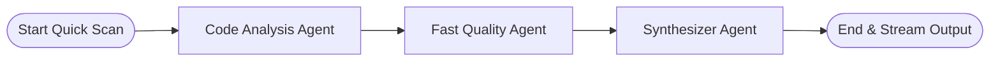
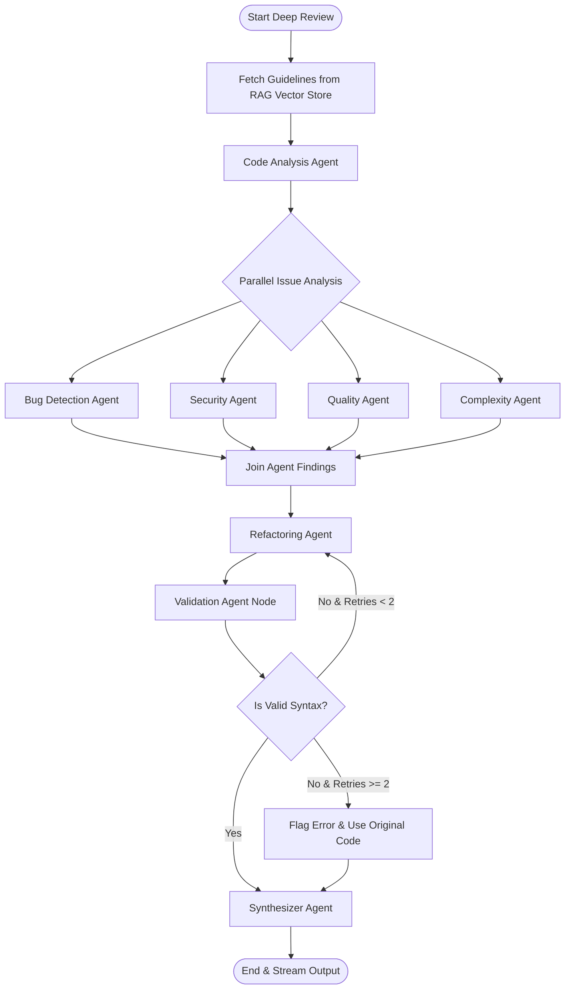

# Multi-Agent System Design & Specification

This document specifies the design, responsibilities, input/output contracts, prompt strategies, and state transition graphs for all agents in the **AI Code Review & Refactoring Platform**.

---

## 1. Overview & LangGraph Shared State Schema

All agents operate on a shared state context defined in `app.graph.state.ReviewState`. Each node in the LangGraph execution graph consumes fields from this state and returns state mutations.

### 1.1 Shared Graph State (`ReviewState`)

```python
from typing import TypedDict, List, Dict, Any, Optional

class CodeIssueDict(TypedDict):
    line: int
    severity: str  # "CRITICAL" | "HIGH" | "MEDIUM" | "LOW" | "INFO"
    category: str  # "BUG" | "SECURITY" | "PERFORMANCE" | "STYLE" | "COMPLEXITY"
    description: str
    suggestion: str

class ComplexityMetricsDict(TypedDict):
    cyclomatic_complexity: int
    cognitive_complexity: int
    assessment: str

class ReviewState(TypedDict):
    # Input Data
    code: str
    language: str
    mode: str  # "quick" | "deep"
    
    # RAG Context
    rag_context: List[str]
    
    # Agent Outputs (Accumulated across nodes)
    code_structure: Optional[Dict[str, Any]]
    explanation: Optional[str]
    bug_issues: List[CodeIssueDict]
    security_issues: List[CodeIssueDict]
    quality_issues: List[CodeIssueDict]
    complexity_assessment: Optional[ComplexityMetricsDict]
    readability_score: Optional[int]
    refactored_code: Optional[str]
    validation_status: Optional[Dict[str, Any]]
    validation_retry_count: int
    
    # Consolidated Final Output
    final_result: Optional[Dict[str, Any]]
    
    # Execution Metadata
    llm_provider_used: str
    execution_trace_id: str
```

---

## 2. Agent Catalog & Detailed Specifications

### 2.1 Code Analysis Agent (`code_analysis_agent.py`)
- **Single Responsibility**: Perform initial AST/structural code parsing, language verification, logic extraction, and high-level architectural explanation.
- **Execution**: Runs first in both Quick Scan and Deep Review graphs.
- **Input Shape**: `code: str`, `language: str`
- **Output Shape**: `code_structure: Dict[str, Any]`, `explanation: str`, `detected_language: str`
- **Structured Output Schema**:
  ```python
  from pydantic import BaseModel, Field

  class CodeAnalysisOutput(BaseModel):
      detected_language: str = Field(description="Normalized programming language name")
      summary: str = Field(description="High-level 2-sentence summary of what the code does")
      explanation: str = Field(description="Step-by-step explanation of code architecture and execution flow")
      imported_modules: list[str] = Field(default_factory=list, description="List of imported packages/modules")
      functions_defined: list[str] = Field(default_factory=list, description="Names of defined functions/methods")
  ```

---

### 2.2 Bug Detection Agent (`bug_agent.py`)
- **Single Responsibility**: Detect logical bugs, off-by-one errors, null pointers, unhandled exceptions, race conditions, and boundary condition failures.
- **Execution**: Runs in parallel during Deep Review.
- **Input Shape**: `code: str`, `language: str`, `code_structure: Dict`
- **Output Shape**: `bug_issues: List[CodeIssueDict]`
- **Structured Output Schema**:
  ```python
  class BugDetectionOutput(BaseModel):
      issues: list[CodeIssueDict] = Field(description="List of identified logical bugs")
  ```

---

### 2.3 Security Agent (`security_agent.py`)
- **Single Responsibility**: Analyze source code for security vulnerabilities, injection flaws (SQLi, XSS, Command Injection), insecure cryptography, hardcoded secrets, and OWASP/CWE violations.
- **Execution**: Runs in parallel during Deep Review (augmented by RAG security guidelines).
- **Input Shape**: `code: str`, `language: str`, `rag_context: List[str]`
- **Output Shape**: `security_issues: List[CodeIssueDict]`
- **Structured Output Schema**:
  ```python
  class SecurityAnalysisOutput(BaseModel):
      issues: list[CodeIssueDict] = Field(description="List of detected security vulnerabilities with CWE/OWASP references")
  ```

---

### 2.4 Quality & Readability Agent (`quality_agent.py`)
- **Single Responsibility**: Assess code style adherence, variable naming conventions, anti-patterns, DRY violations, and readability.
- **Execution**: Runs in Quick Scan (fast mode) and Deep Review.
- **Input Shape**: `code: str`, `language: str`
- **Output Shape**: `quality_issues: List[CodeIssueDict]`, `readability_score: int`
- **Structured Output Schema**:
  ```python
  class QualityAnalysisOutput(BaseModel):
      readability_score: int = Field(ge=0, le=100, description="Readability score between 0 and 100")
      issues: list[CodeIssueDict] = Field(description="Code smell, style, and readability suggestions")
  ```

---

### 2.5 Complexity Agent (`complexity_agent.py`)
- **Single Responsibility**: Calculate cyclomatic complexity, cognitive load, nesting depth, and algorithmic time/space complexity.
- **Execution**: Runs in parallel during Deep Review.
- **Input Shape**: `code: str`, `language: str`, `code_structure: Dict`
- **Output Shape**: `complexity_assessment: ComplexityMetricsDict`
- **Structured Output Schema**:
  ```python
  class ComplexityOutput(BaseModel):
      cyclomatic_complexity: int = Field(description="Calculated cyclomatic complexity score")
      cognitive_complexity: int = Field(description="Cognitive load score for developers")
      assessment: str = Field(description="Evaluation of maintainability and testing complexity")
  ```

---

### 2.6 Refactoring Agent (`refactoring_agent.py`)
- **Single Responsibility**: Synthesize all reported issues (bugs, security vulnerabilities, quality improvements, complexity fixes) and generate optimized, clean refactored source code.
- **Execution**: Runs sequentially after issue detection agents complete.
- **Input Shape**: `code: str`, `language: str`, `bug_issues`, `security_issues`, `quality_issues`, `complexity_assessment`
- **Output Shape**: `refactored_code: str`
- **Structured Output Schema**:
  ```python
  class RefactoringOutput(BaseModel):
      refactored_code: str = Field(description="Complete refactored source code string")
      key_changes: list[str] = Field(description="Summary list of refactoring improvements made")
  ```

---

### 2.7 Validation Agent (`validation_agent.py`)
- **Single Responsibility**: Validate syntax correctness of the generated refactored code using AST compilers/parsers. Trigger retry edge if syntax errors are present.
- **Execution**: Runs directly after Refactoring Agent.
- **Input Shape**: `refactored_code: str`, `language: str`, `validation_retry_count: int`
- **Output Shape**: `validation_status: Dict[str, Any]` (e.g., `{"is_valid": True, "error": None}`)
- **Behavior**:
  - `is_valid == True`: Transition to Synthesizer Agent.
  - `is_valid == False` and `retry_count < 2`: Increment `validation_retry_count`, route back to Refactoring Agent with error traceback.
  - `is_valid == False` and `retry_count >= 2`: Fall back to original code with warning flag, transition to Synthesizer.

---

### 2.8 Synthesizer Agent (`synthesizer_agent.py`)
- **Single Responsibility**: Aggregate, deduplicate, rank by line number/severity, and format all agent findings into the unified canonical `CodeReviewResult` schema.
- **Execution**: Final terminal node in both Quick Scan and Deep Review graphs.
- **Input Shape**: Full `ReviewState`
- **Output Shape**: `final_result: CodeReviewResult`

---

## 3. LangGraph Workflow Diagrams

### 3.1 Quick Scan Workflow Graph



### 3.2 Deep Review Workflow Graph


