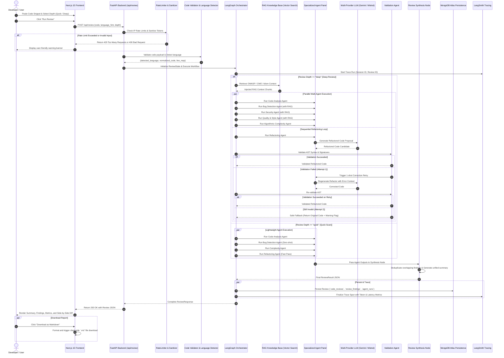
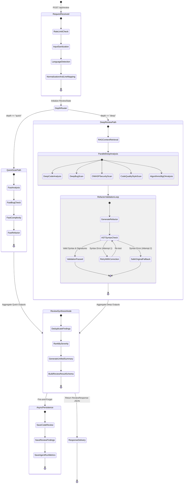

# Review Execution Workflow & State Diagrams

This document details the complete end-to-end runtime lifecycle of a code review request across the frontend, FastAPI backend, LangGraph multi-agent orchestrator, RAG layer, and persistence layers.

---

## 🔁 End-to-End Execution Sequence Diagram

---

## 🔀 Workflow State Machine (Quick Scan vs. Deep Review)

The following state machine illustrates the two divergent execution pipelines and how they converge at the deterministic **Review Synthesis** phase:

---

## 🔍 Stage-by-Stage Breakdown

### 1. Ingestion & Security Screening
- **Rate Limiting**: Checks the client IP against a token bucket algorithm to prevent abuse.
- **Payload Inspection**: The request body is screened for length and minimum token count to ensure it is authentic source code.
- **Language Identification**: Pygments scans token distributions to identify the language (Python, JavaScript, TypeScript, Java, Go, C++, Rust, etc.).

### 2. Context Grounding (RAG)
- In **Deep Review** mode, the detected language and code tokens are used to retrieve targeted security rules (e.g., OWASP Injection, XSS, CSRF, insecure deserialization) and language style rules from MongoDB Atlas Vector Search.

### 3. Agent Execution & Isolation
- Each agent operates in its own isolated try/except execution boundary.
- If one LLM call fails or times out, fallback providers (Mistral) are attempted. If both fail, an error stub is recorded in state without failing the rest of the review.

### 4. Deterministic Refactoring Loop
- Refactored code must pass AST parsing.
- If code fails parsing, an exact error message is fed back into the refactoring prompt for a single repair attempt.
- If the repair attempt also fails, the original code is returned with `refactoring_validated: false`.

### 5. Synthesis & Deduplication
- Overlapping issues reported by bug, security, and quality agents are grouped by exact line number and cosine text similarity.
- Findings are mapped to the highest severity category: `vulnerability` > `bug` > `style`.
- A concise, cohesive summary paragraph is compiled.

### 6. Persistence & Presentation
- The review is saved to MongoDB Atlas collections (`code_reviews`, `review_findings`, `agent_runs`).
- LangSmith records end-to-end token latency and generation traces.
- The Next.js frontend renders findings, metrics, and side-by-side diff views.
